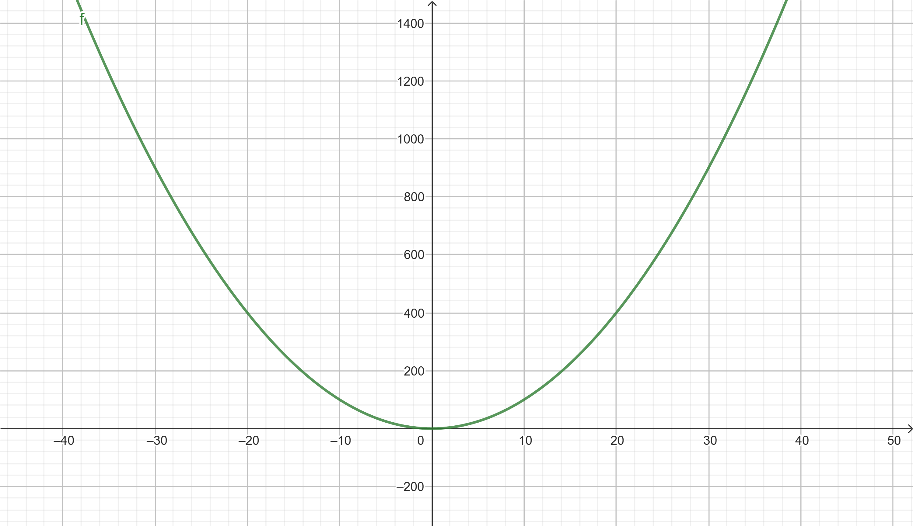
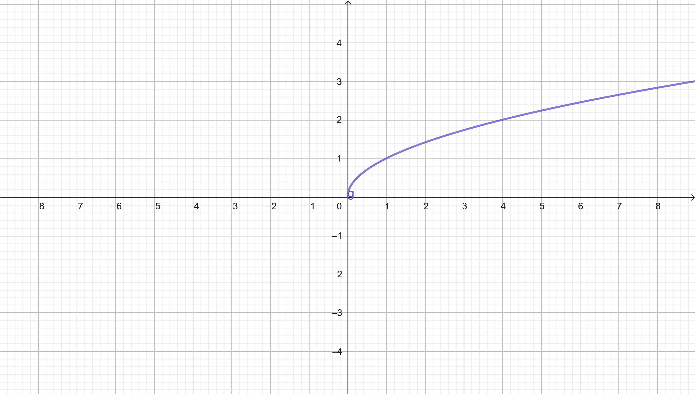
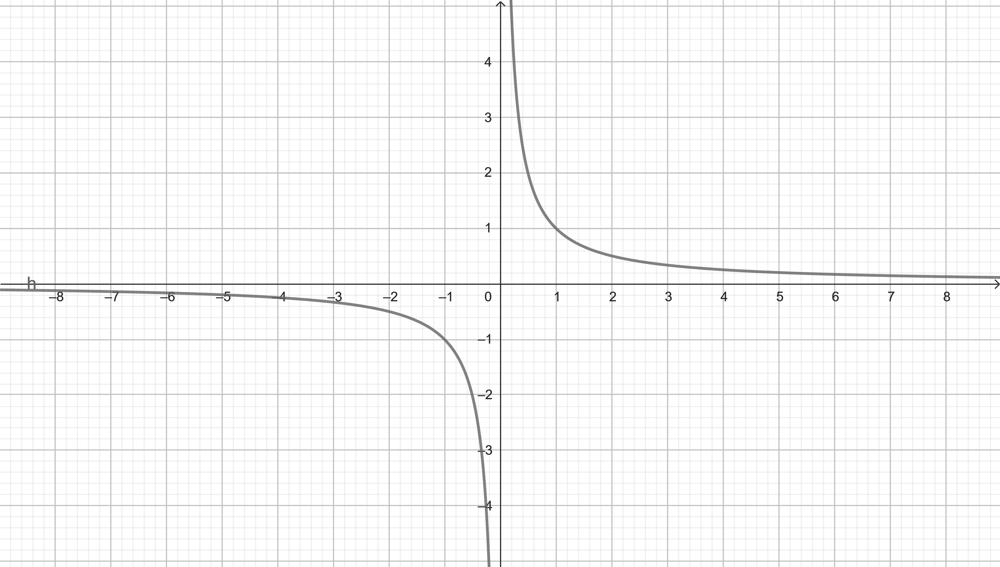

# Calculus

## Functions

1. Draw in a single Geogebra notebook the following functions:
   $f(x) = x^2$

   - $g(x) = \sqrt{x}$

   

   - $h(x) = \frac{1}{x}$

   
   - $j(x) = \sin(x)$

Find value of all the above functions at $x = 2$.

2. Let $f(x) = 3x - 1$ and $g(x) = \sqrt{x}$. Find:
   - $f(g(x))$
   - $g(f(x))$
   - $f(f(x))$
   - $g(g(x))$

and visualize functions in a single Geogebra notebook.

3. Let $f(x) = e^x$ and $g(x) = \ln(x)$. Check: $f(g(x))$ and $g(f(x))$. What do you notice?

4. We have function $f=\{(1,7), (2,9), (3,11)\}$. Give inverse function $f^{-1}$.

5. We have function $f=\{(1,7), (2,7), (3,11)\}$. Give inverse function $f^{-1}$.

6. We have function $f(x)= x-1$. Give inverse function $f^{-1}$. Show both functions on the same Geogebra notebook.

## Limits of Sequences

1. Calculate:
   - $\displaystyle \lim_{n \to \infty} \frac{n^2 + 3n}{2 n^2 - 2n}$

   - $\displaystyle \lim_{n \to \infty} \frac{(2n+3)^3}{n^3-1}$

2. Prove using the squeeze theorem:
   - $\displaystyle\lim_{n \to \infty} \frac{\sin(n)}{n}$

4. Find the limit of the sequence:
   - $a_n = (1+\frac{1}{n})^n$

## Limits of Real Functions

1. Compute:
   - $\displaystyle\lim_{x \to \infty} \frac{x^3 + 2x^2}{x^4 - 3x^3}$

2. Find:
   
   - $\displaystyle \lim_{x \to 0} \frac{\sin(3x)}{2x+1}$.

4. Find the asymptotes of the function:
  
   - $f(x) = \frac{x^2 - 1}{x^2 + 1}$
   - $g(x) = \frac{\sin(x)}{x^2+1}$

## Derivatives

1. Compute derivatives of functions:
   * $y(x) = -3x+3$
   * $y(x) = \pi x + \sin(1)$
   * $y(x) = 4+\sin(2)$
   * $y(x) = 2x^3 - 3x^2 + 8x - 9$
   * $y(x) = 6 x^{1/3}$
   * $y(x) = \sqrt{x}$
   * $y(x) = \cos(x) + \sin(x)$
   * $y(x) = 2\sin(x) \cos(x)$
   * $y(x) = x\sin(x)$
   * $y(x) = (x+1)(x+1)$
   * $y(x) = \frac{x}{x+1}$
   * $y(x) = (x+1)\exp(x)$
   * $y(x) = \sin(x^2)$
   * $y(x) = \exp(-2x)$
   * $y(x) = \frac{1}{\sin(x+1)}$
   * $y(x) = \sqrt{2x+1}$

2. Prove:
   - $\frac{d}{dx} (\ln(\sin(x))) = \cot(x)$

3. For $f(x) = \cos(x)$, verify that $f''(x) = -f(x)$.

4. Using de l'Hospital's Rule, find the improper limits:
   - $\displaystyle \lim_{x\to 0} \frac{\sin{x}}{x}$

   - $\displaystyle \lim_{x\to \infty} \frac{\ln x}{x}$

   - $\displaystyle \lim_{x\to \infty} \frac{\exp(x)}{x}$

5. In physics, the position of a particle is given by $x(t) = 3t^2 - 6t + 1$. Find the velocity $V(t)=x'(t)$ and acceleration $a(t)=V'(t)=x''(t)$ of the particle at time $t = 2$.

## Extremum

6. The profit function is $P(u) = -2u^2 + 50u - 300$, where $u$ is the number of units sold. Find the number of units that maximize profit.

7. You have 10 meters of string, and you need to use it to enclose the largest possible rectangular. Find the dimensions of the rectangle.

8. Find extremum od $f(x) = x^2 + 3x - 5$.

9. Find extremum of $f(x) =\frac{x^2+2x+1}{x-1}$.

## Taylor Series

1. Find the Taylor series and visualize obtained functions in Geogebra:
   - $f(x) = \cos(x)$ around $x = 0$ up to the 4th degree.
   - $h(x) = 1/(1-x)$ around $x = 0$ up to the 4rd degree.
   - $g(x) = \sin(x)$ around $x = \pi$ up to the 4rd degree.

2. Find a tangent line $y = f'(x_0) (x-x_0) + f(x_0)$ to the function $f(x) = e^{\sin(x)}$ at $x_0 = \pi$. Hints for Geogebra visualization: define f(x), include slider s, define y = f'(s) (x-s) + f(s), and include point P(s, f(s)).

## Integrals

1. Compute:
   - $\int 1 dx$
   - $\int (x^2 +2) dx$
   - $\int 2\sin(x) dx$
   - $\int \frac{3}{x} dx$
   - $\int \frac{1}{x^2} dx$
   - $\int \left( \frac{1}{3}x^4 - 5 \right) \, dx$
   - $\int (\sin^2 x + \cos^2 x) \, dx$
   - $\int (5 \sin x + 3e^x) \, dx$
   - $\int \sqrt[3]{x} \, dx$
   - $\int \sqrt{10x} \, dx$
   - $\int \cos\left(\frac{5}{2}x + 3\right) \, dx$
   - $\int \frac{\cos(\ln(x))}{x} \, dx$
   - $\int x \ln(x) \, dx$
   - $\int x e^x \, dx$

2. Calculate integrals over the interval $[0, \pi]$ and visualize them in Geogebra:
   - $f(x)=2x+1$
   - $g(x)=x^2$

3. Calculate the area of the region bounded by the lines:
$x = 1$, $x = 2$, $y = 0$, and $y = x^2 + 1$. Show it in Geogebra.

4. Calculate the area under the sine curve over the interval $[0, \pi]$, using:

$$P = \int_a^b f(x) \, dx = \int_0^\pi \sin(x) \, dx$$

5. Calculate the length of the sine curve over the same interval using:

$$L = \int_a^b \sqrt{1 + (f'(x))^2} \, dx= \int_0^\pi \sqrt{1 + \cos^2(x)} \, dx
$$ 

6. Find the distance of the moving particle between time $t=0$ and $t=2$ for the following position function: $x(t) = 3t^2 - 6t + 1$.

## Differential Equations

1. Solve the following first-order ordinary differential equations:
   - $y'(x)= y$
   - $y'(x) = \frac{1}{2y(x)}$
  
3. Solve the first-order ordinary differential equations using the method of separation of variables for $x$ and $y=y(x)$:

   - $\frac{dy}{dx} = \frac{x}{y}$
   - $\frac{dy}{dx} = \frac{y}{x}$
   - $\frac{dy}{dx} = xy$

4. Solve the second-order ordinary differential equations:

   * $y''(x) + y'(x) = 0$, with boundary conditions $y(0) = 2$ and $y'(0) = -1$

   * $y''(x) - y(x)= 0$, with boundary conditions $y(0) = 2$ and $y'(0) = 0$

   * $\frac{d^2\,y(x)}{dx^2} = -\omega^2 y(x)$.

5. Check if the function $\psi(t, x) = A \cos(\omega t + kx)$ is a solution of the second-order partial differential equation (the so-called "wave equation"), where $v = \frac{\omega}{k} = \frac{2\pi / T}{2\pi / \lambda}$:

$$
\frac{\partial^2 \psi(t, x)}{\partial t^2} - v^2 \frac{\partial^2 \psi(t, x)}{\partial x^2} = 0.
$$