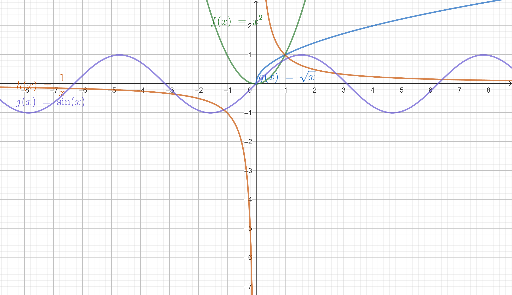
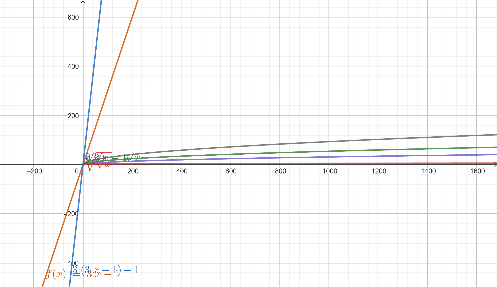
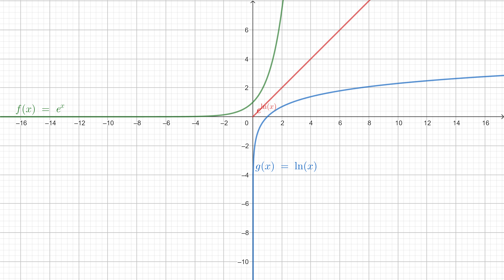
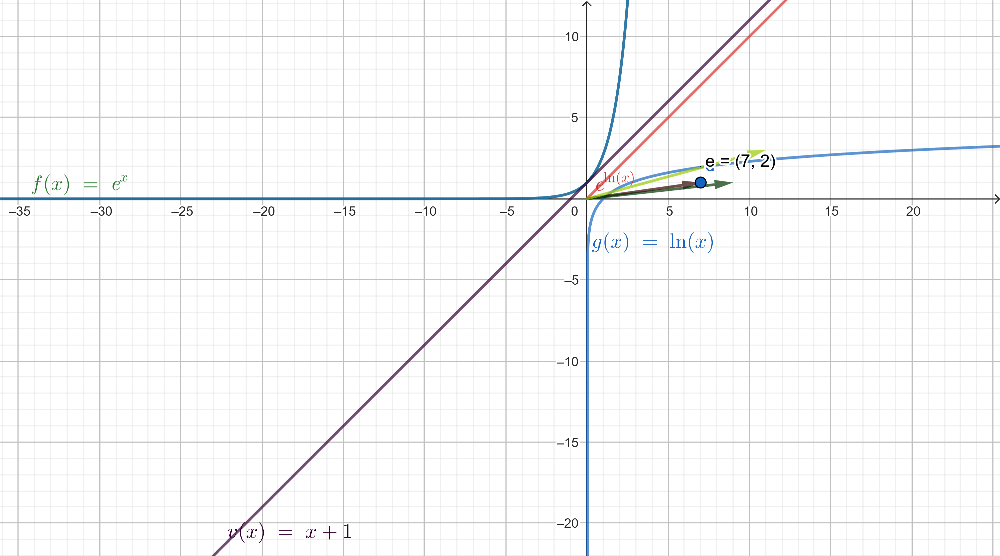

# 18. Functions

The following functions should be plotted in a single Geogebra notebook:

1. Quadratic function:
   $$
   f(x) = x^2
   $$
   For $ x = 2 $:
   $$
   f(2) = 2^2 = 4
   $$

2. Linear function:
   $$
   g(x) = \sqrt{x}
   $$
 For $ x = 2 $:
   $$
   g(2) = \sqrt2
   $$
    which is approximateely 1.41

3. Reciprocal function:
   $$
   h(x) = \frac{1}{x}
   $$
 For $ x = 2 $:
   $$
   h(4) = \frac{1}{2} = 0.5
   $$

4. Sine function:
   $$
   j(x) = \sin(x)
   $$
for $x = 2 $:
$$
j(2) = sin(2) = 1
$$

### Find value of all the above functions at $ x = 2 $

Let $ f(x) = 3x - 1 $ and $ g(x) = x $. Find the following:
### 1. $( f(g(x)) $)
Substitute $( g(x) = x $) into $( f(x) = 3x - 1 $):

$
f(g(x)) = f(x) = 3x - 1
$

**Solution**: $ f(g(x)) = 3x - 1 $

---

### 2. $ g(f(x)) $
Substitute $ f(x) = 3x - 1 $ into $ g(x) = x $:

$$
g(f(x)) = g(3x - 1) = 3x - 1
$$

**Solution**: $ g(f(x)) = 3x - 1 $

---

### 3. $( f(f(x)) $)
Substitute $ f(x) = 3x - 1 $ into itself:

$
f(f(x)) = f(3x - 1) = 3(3x - 1) - 1 = 9x - 3 - 1 = 9x - 4
$

**Solution**: $ f(f(x)) = 9x - 4 $

---

### 4. $( g(g(x)) $)
Substitute $ g(x) = x $ into itself:

$
g(g(x)) = g(x) = x
$

**Solution**: $ g(g(x)) = x $

----

 3. Let $f(x) = e^x$ and $g(x)= ln(x)$ check  $f(g(x))$ and $g(f(x)) $. What do you notice?
 ### Problem: Let $ f(x) = e^x  $ and $ g(x) = \ln(x) $. Find $ f(g(x)) $ and $ g(f(x)) $, and observe the result.

---

### Step 1: Compute $ f(g(x)) $
$$
f(g(x)) = f \ln(x)) = e^{\ln(x)}.
$$
Using the property of logarithms and exponents $ e^{\ln(x)} = x $ for $ x > 0 $, we get:
$$
f(g(x)) = x, \quad \text{for } x > 0.
$$

---

### Step 2: Compute $ g(f(x)) $
$$
g(f(x)) = g(e^x) = \ln(e^x).
$$
Using the property of logarithms $ \ln(e^x) = x $, we get:
$$
g(f(x)) = x.
$$

---

### Conclusion
Both compositions result in the identity function:
$$
f(g(x)) = x \quad \text{and} \quad g(f(x)) = x.
$$
Thus, $ f(x) = e^x $ and $ g(x) = \ln(x) $ are **inverse functions** of each other.

---

 4. We have function f = (1, 7), (1, 9), (3, 11). Give inverse function $f{^-1}$

### Problem: Given $ f = \{(1, 7), (1, 9), (3, 11)\} $, find the inverse function $ f^{-1} $.

---

### Step 1: Understanding the Inverse Function
The inverse function $ f^{-1} $ swaps the roles of the input and output values of $ f $. That is, if $ f(a) = b $, then $ f^{-1}(b) = a $.

---

### Step 2: Swap the Pairs
The given function $ f $ is:
$$
f = \{(1, 7), (1, 9), (3, 11)\}.
$$

Swapping the pairs, we get:
$$
f^{-1} = \{(7, 1), (9, 1), (11, 3)\}.
$$

---

### Step 3: Analyze the Result
The inverse function $ f^{-1} $ is:
$$
f^{-1} = \{(7, 1), (9, 1), (11, 3)\}.
$$

**Note:** The original function $ f $ is not a valid function because it has multiple outputs  7  and  9  for the same input  1 . As a result, the inverse $ f^{-1} $ is also not a valid function, since it assigns the same input 1  to multiple outputs  7  and  9 .

---

### Final Answer
$$
f^{-1} = \{(7, 1), (9, 1), (11, 3)\}.
$$

**Conclusion:** Neither $ f $ nor $ f^{-1} $ satisfies the definition of a function due to multiple outputs for a single input.

 5. We have function f = (1, 7), (2, 7), (3, 11). Give inverse function $f^{-1}$

 $ f^{-1} = ((7, 1), (7, 2), (11, 3))$

 6. We have function $f(x) = x - 1$. Give inverse function $f^{-1}$. 
 
 ## If $f(x) = x - 1 $

 $f^{-1} = x + 1$

 Show both functions on the same Geogebra notebook.

  
## 19 Limits of sequence

### 1. Evaluate $ \lim_{n \to \infty} \frac{n^2 + 3n^2}{n^2 - 2n} $

#### Simplify the expression:
$$
\frac{n^2 + 3n^2}{n^2 - 2n} = \frac{4n^2}{n^2 - 2n}.
$$

#### Factor out $ n^2 $ in the denominator:
$$
\frac{4n^2}{n^2 - 2n} = \frac{4n^2}{n^2(1 - \frac{2}{n})}.
$$

Cancel $ n^2 $ in the numerator and denominator:
$$
\frac{4n^2}{n^2(1 - \frac{2}{n})} = \frac{4}{1 - \frac{2}{n}}.
$$

#### Take the limit as $ n \to \infty $:
As $ n \to \infty $, $ \frac{2}{n} \to 0 $, so:
$$
\lim_{n \to \infty} \frac{4}{1 - \frac{2}{n}} = \frac{4}{1 - 0} = 4.
$$

---

### 2. Evaluate $ \lim_{n \to \infty} \frac{(2n + 3)}{3n^3 - 1} $

#### Simplify the numerator and denominator:
Focus on the highest power of $ n $:
$$
\frac{(2n + 3)}{3n^3 - 1}.
$$

#### Factor out the highest power of $ n $ in the denominator:
Divide both numerator and denominator by $ n^3 $:
$$
\frac{\frac{2n}{n^3} + \frac{3}{n^3}}{3 - \frac{1}{n^3}} = \frac{\frac{2}{n^2} + \frac{3}{n^3}}{3 - \frac{1}{n^3}}.
$$

#### Take the limit as $ n \to \infty $:
As $ n \to \infty $, both $ \frac{2}{n^2} $ and $ \frac{3}{n^3} $ approach 0, and $ \frac{1}{n^3} $ also approaches 0. Thus:

$$
\lim_{n \to \infty} \frac{\frac{2}{n^2} + \frac{3}{n^3}}{3 - \frac{1}{n^3}} = \frac{0 + 0}{3 - 0} = 0.
$$

---

### Final Answer
1. $ \lim_{n \to \infty} \frac{n^2 + 3n^2}{n^2 - 2n} = 4.$

2. $ \lim_{n \to \infty} \frac{2n + 3}{3n^3 - 1} = 0. $

To prove $\lim_{n \to \infty} \frac{\sin(n)}{n} = 0 $ using the Squeeze Theorem, follow these steps:

---

## 2. Prove using squeeze theorem

### Step 1: Understand the bounds of $\sin(n) $
The sine function satisfies:
$$
-1 \leq \sin(n) \leq 1, \quad \text{for all } n.
$$

Divide through by $n > 0 $ (since $n \to \infty $, $n $ is always positive):
$$
-\frac{1}{n} \leq \frac{\sin(n)}{n} \leq \frac{1}{n}.
$$

---

### Step 2: Take the limits of the bounds
As $n \to \infty $, both $\frac{1}{n} $ and $-\frac{1}{n} $ approach 0:
$$
\lim_{n \to \infty} \left(-\frac{1}{n}\right) = 0 \quad \text{and} \quad \lim_{n \to \infty} \frac{1}{n} = 0.
$$

---

### Step 3: Apply the Squeeze Theorem
Since $\frac{\sin(n)}{n} $ is "squeezed" between $-\frac{1}{n} $ and $\frac{1}{n} $, and both of these bounds approach 0 as $n \to \infty $, it follows by the Squeeze Theorem that:
$$
\lim_{n \to \infty} \frac{\sin(n)}{n} = 0.
$$

---

### Final Answer
$$
\boxed{\lim_{n \to \infty} \frac{\sin(n)}{n} = 0.}
$$

---

## 3.  Find a limit of sequence 
The sequence $ a_n = \left(1 + \frac{1}{n}\right)^n $ is a well-known limit, which converges to the mathematical constant $ e $. Here's the detailed reasoning:

---

### Step 1: Recognize the definition of $ e $
The number $ e $ is defined as:
$$
e = \lim_{n \to \infty} \left(1 + \frac{1}{n}\right)^n.
$$

Thus, the limit of the sequence $ a_n $ is:
$$
\lim_{n \to \infty} \left(1 + \frac{1}{n}\right)^n = e.
$$

---

### Step 2: Intuition (optional logarithmic manipulation)
To verify this limit, consider the natural logarithm:
$$
\ln(a_n) = \ln\left(\left(1 + \frac{1}{n}\right)^n\right) = n \ln\left(1 + \frac{1}{n}\right).
$$

Using the approximation $ \ln(1 + x) \approx x $ for small $ x $, we have:
$$
n \ln\left(1 + \frac{1}{n}\right) \approx n \cdot \frac{1}{n} = 1.
$$

Exponentiating both sides:
$$
a_n \approx e^1 = e.
$$

Thus, $ \lim_{n \to \infty} a_n = e $ is confirmed.

---

### Final Answer
$$
\boxed{\lim_{n \to \infty} \left(1 + \frac{1}{n}\right)^n = e.}
$$

# 20. Limits of Real Function

1. To compute $ \lim_{x \to \infty} \frac{x^3 + 2x^2}{x^4 - 3x^3} $, follow these steps:

---

### Step 1: Factor out the highest power of $ x $ from both numerator and denominator
In the numerator, the highest power of $ x $ is $ x^3 $, and in the denominator, it is $ x^4 $. Divide both numerator and denominator by $ x^4 $:
$$
\frac{x^3 + 2x^2}{x^4 - 3x^3} = \frac{\frac{x^3}{x^4} + \frac{2x^2}{x^4}}{\frac{x^4}{x^4} - \frac{3x^3}{x^4}}.
$$

Simplify the terms:
$$
\frac{x^3 + 2x^2}{x^4 - 3x^3} = \frac{\frac{1}{x} + \frac{2}{x^2}}{1 - \frac{3}{x}}.
$$

---

### Step 2: Take the limit as $ x \to \infty $
As $ x \to \infty $, the terms $ \frac{1}{x} $ and $ \frac{2}{x^2} $ approach 0, and $ \frac{3}{x} $ also approaches 0. Thus:
$$
\lim_{x \to \infty} \frac{\frac{1}{x} + \frac{2}{x^2}}{1 - \frac{3}{x}} = \frac{0 + 0}{1 - 0} = 0.
$$

---

### Final Answer
$$
\boxed{\lim_{x \to \infty} \frac{x^3 + 2x^2}{x^4 - 3x^3} = 0.}
$$

2. To find $ \lim_{x \to 0} \frac{\sin(3x)}{2x + 1} $, follow these steps:

---

### Step 1: Examine the behavior of the numerator and denominator
The numerator is $ \sin(3x) $, and the denominator is $ 2x + 1 $.

- As $ x \to 0 $, $ \sin(3x) \to 0 $.
- As $ x \to 0 $, $ 2x + 1 \to 1 $.

---

### Step 2: Apply the limit directly
Since $ \sin(3x) $ is continuous, we can substitute $ x = 0 $ directly into the expression:
$$
\lim_{x \to 0} \frac{\sin(3x)}{2x + 1} = \frac{\sin(0)}{2(0) + 1} = \frac{0}{1} = 0.
$$

---

### Final Answer
$$
\boxed{\lim_{x \to 0} \frac{\sin(3x)}{2x + 1} = 0.}
$$

3. Find a symptote function:
Let's find the asymptotes for the two functions:

### 1. Function $ f(x) = \frac{x^2 - 1}{x^2 + 1} $

#### Vertical Asymptotes:
Vertical asymptotes occur where the denominator of the function equals 0, but the numerator is non zero at those points.

The denominator of $ f(x) $ is $ x^2 + 1 $. Setting the denominator equal to 0:
$$
x^2 + 1 = 0 \quad \Rightarrow \quad x^2 = -1.
$$
Since there is no real solution to $ x^2 = -1 $, there are **no vertical asymptotes** for $ f(x) $.

#### Horizontal Asymptotes:
Horizontal asymptotes describe the behavior of the function as $ x \to \infty $ or $ x \to -\infty $.

To find the horizontal asymptote, divide the terms in the numerator and denominator by $ x^2 $ (the highest power of $ x $):
$$
f(x) = \frac{x^2 - 1}{x^2 + 1} = \frac{1 - \frac{1}{x^2}}{1 + \frac{1}{x^2}}.
$$
As $ x \to \infty $, both $ \frac{1}{x^2} \to 0 $, so the function approaches:
$$
f(x) \to \frac{1 - 0}{1 + 0} = 1.
$$

Thus, the horizontal asymptote for $ f(x) $ is:
$$
y = 1.
$$

### 2. Function $ g(x) = \frac{\sin(x)}{x^2 + 1} $

#### Vertical Asymptotes:
Vertical asymptotes occur where the denominator equals 0 and the numerator does not equal 0. The denominator of $ g(x) $ is $ x^2 + 1 $, and solving for vertical asymptotes:
$$
x^2 + 1 = 0 \quad \Rightarrow \quad x^2 = -1.
$$
There are no real solutions to this equation, so there are **no vertical asymptotes** for $ g(x) $.

#### Horizontal Asymptotes:
As $ x \to \infty $ or $ x \to -\infty $, we analyze the behavior of $ g(x) $.

The numerator $ \sin(x) $ is bounded between $ -1 $ and $ 1 $, while the denominator $ x^2 + 1 \to \infty $ as $ x \to \infty $. Therefore, as $ x \to \infty $ or $ x \to -\infty $, $ g(x) $ approaches 0.

Thus, the horizontal asymptote for $ g(x) $ is:
$$
y = 0.
$$

### Final Answer:
- For $ f(x) = \frac{x^2 - 1}{x^2 + 1} $, the horizontal asymptote is $ y = 1 $, and there are **no vertical asymptotes**.

- For $ g(x) = \frac{\sin(x)}{x^2 + 1} $, the horizontal asymptote is $ y = 0 $, and there are **no vertical asymptotes**.