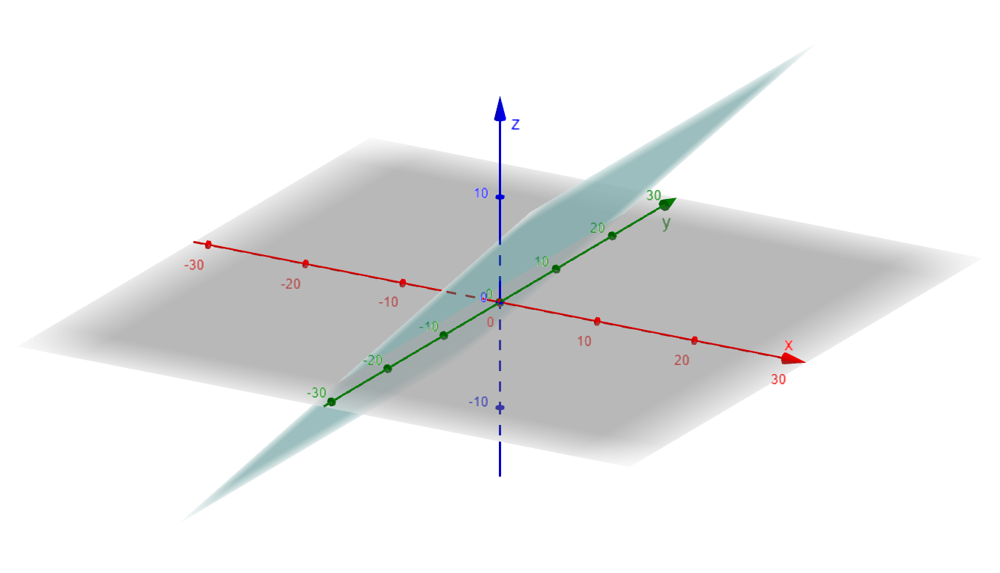
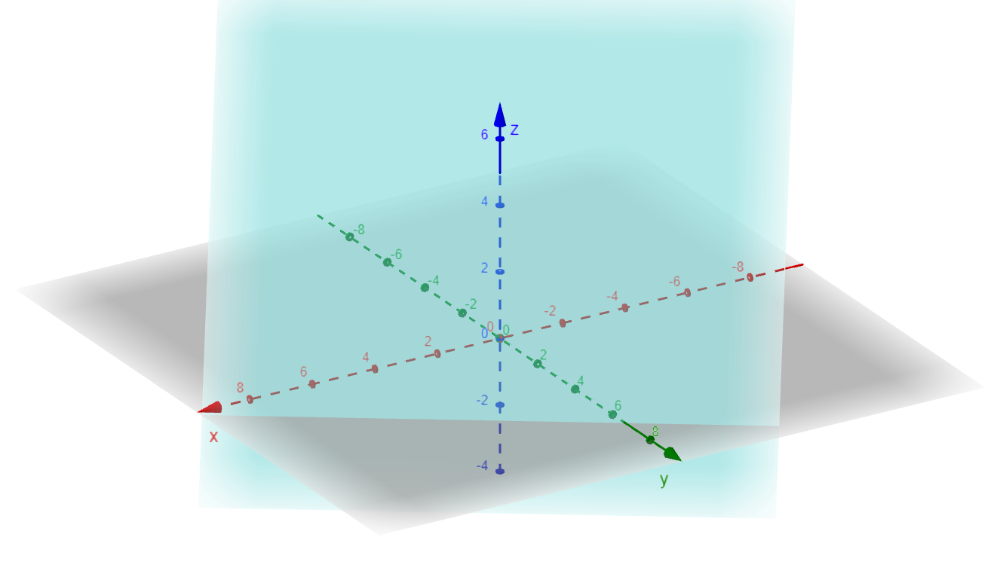
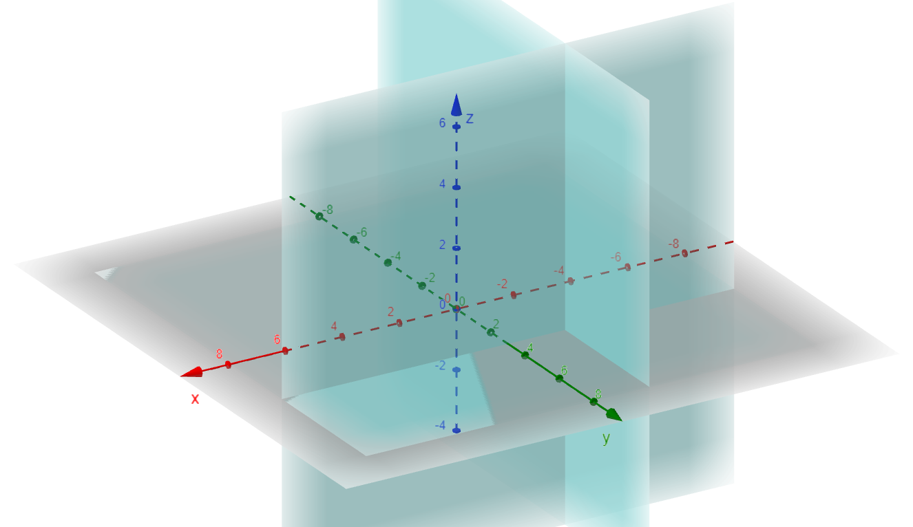

### Equations of planes in space
The plane passes through points \( A(1, 2, 3) \), \( B(3, 4, 5) \), and \( C(2, 1, 4) \). Find the equation of the plane.

### Solution

To find the equation of the plane, we use the general form:  
$$
ax + by + cz + d = 0
$$

#### Step 1: Compute two vectors in the plane  
Let:
$$
\vec{AB} = B - A = (3 - 1, 4 - 2, 5 - 3) = (2, 2, 2)
$$
$$
\vec{AC} = C - A = (2 - 1, 1 - 2, 4 - 3) = (1, -1, 1)
$$

#### Step 2: Find the normal vector to the plane  
The normal vector $(\vec{n}$) is given by the cross product of $(\vec{AB}$) and $(\vec{AC}$):  
$$
\vec{n} = \vec{AB} \times \vec{AC}
$$
Using the determinant method:
$$
\vec{n} = \begin{vmatrix} 
\mathbf{i} & \mathbf{j} & \mathbf{k} \\ 
2 & 2 & 2 \\ 
1 & -1 & 1 
\end{vmatrix}
$$
$$
\vec{n} = \mathbf{i} \begin{vmatrix} 2 & 2 \\ -1 & 1 \end{vmatrix} 
- \mathbf{j} \begin{vmatrix} 2 & 2 \\ 1 & 1 \end{vmatrix} 
+ \mathbf{k} \begin{vmatrix} 2 & 2 \\ 1 & -1 \end{vmatrix}
$$
$$
\vec{n} = \mathbf{i}(2 - (-2)) - \mathbf{j}(2 - 2) + \mathbf{k}(-2 - 2)
$$
$$
\vec{n} = 4\mathbf{i} + 0\mathbf{j} - 4\mathbf{k}
$$
$$
\vec{n} = (4, 0, -4)
$$

#### Step 3: Use the point-normal form of the plane  
The equation of the plane is:
$$
4(x - 1) + 0(y - 2) - 4(z - 3) = 0
$$
Simplify:
$$
4x - 4 - 4z + 12 = 0
$$
$$
4x - 4z + 8 = 0
$$

#### Final Answer  
The equation of the plane is:
$$
4x - 4z + 8 = 0
$$

The plane passes through point \( A(1, 2, 3) \) and is parallel to the plane \( 2x + 3y + 4z = 5 \). Find the equation of the plane.

### Solution

If two planes are parallel, they share the same normal vector. The equation of the given plane is \( 2x + 3y + 4z = 5 \), so its normal vector is:
$$
\vec{n} = (2, 3, 4)
$$

The general equation of a plane is:
$$
2x + 3y + 4z + d = 0
$$

#### Step 1: Use the point \( A(1, 2, 3) \) to determine \( d \)  
Substitute \( A(1, 2, 3) \) into the equation:
$$
2(1) + 3(2) + 4(3) + d = 0
$$
$$
2 + 6 + 12 + d = 0
$$
$$
20 + d = 0
$$
$$
d = -20
$$

#### Step 2: Write the equation of the plane  
The equation of the plane is:
$$
2x + 3y + 4z - 20 = 0
$$

#### Final Answer  
The equation of the plane is:
$$
2x + 3y + 4z - 20 = 0
$$

### Problem

The plane passes through point \( A(1, 2, 3) \) and is perpendicular to the normal vector \( \vec{n} = (2, 3, 4) \). Find the equation of the plane.

### Solution

To find the equation of the plane, we use the general equation of a plane:

$$
a(x - x_0) + b(y - y_0) + c(z - z_0) = 0
$$

where \( (x_0, y_0, z_0) \) is a point on the plane, and \( (a, b, c) \) is the normal vector.

Since the normal vector is \( \vec{n} = (2, 3, 4) \) and the plane passes through point \( A(1, 2, 3) \), we substitute these values into the equation:

$$
2(x - 1) + 3(y - 2) + 4(z - 3) = 0
$$

### Step 1: Expand the equation

$$
2(x - 1) + 3(y - 2) + 4(z - 3) = 0
$$
$$
2x - 2 + 3y - 6 + 4z - 12 = 0
$$
$$
2x + 3y + 4z - 20 = 0
$$

### Final Answer
### Problem

The plane passes through point \( A(1, 2, 3) \) and is perpendicular to the normal vector \( \vec{n} = (2, 3, 4) \). Find the equation of the plane.

### Solution

To find the equation of the plane, we use the general equation of a plane:

$$
a(x - x_0) + b(y - y_0) + c(z - z_0) = 0
$$

where \( (x_0, y_0, z_0) \) is a point on the plane, and \( (a, b, c) \) is the normal vector.

Since the normal vector is \( \vec{n} = (2, 3, 4) \) and the plane passes through point \( A(1, 2, 3) \), we substitute these values into the equation:

$$
2(x - 1) + 3(y - 2) + 4(z - 3) = 0
$$

### Step 1: Expand the equation

$$
2(x - 1) + 3(y - 2) + 4(z - 3) = 0
$$
$$
2x - 2 + 3y - 6 + 4z - 12 = 0
$$
$$
2x + 3y + 4z - 20 = 0
$$

### Final Answer

The equation of the plane is:

$$
2x + 3y + 4z = 20
$$

### Problem

We have two planes:

1. \( 2x + 3y + 4z = 5 \)
2. \( 3x + 4y + 2z = 6 \)

Find the line of intersection of these planes.

### Solution

#### Step 1: Find the Direction Vector of the Line
The direction vector of the line of intersection is the cross product of the normal vectors of the two planes.

**Normal Vectors**:
- The normal vector of the first plane \( 2x + 3y + 4z = 5 \) is \( \vec{n_1} = (2, 3, 4) \).
- The normal vector of the second plane \( 3x + 4y + 2z = 6 \) is \( \vec{n_2} = (3, 4, 2) \).

The direction vector \( \vec{d} \) of the line of intersection is given by the cross product:

$$
\vec{d} = \vec{n_1} \times \vec{n_2}
$$

Let’s calculate the cross product:

$$
\vec{d} = \begin{vmatrix}
\hat{i} & \hat{j} & \hat{k} \\
2 & 3 & 4 \\
3 & 4 & 2
\end{vmatrix}
$$

Expanding this determinant:

$$
\vec{d} = \hat{i} \left( \begin{vmatrix} 3 & 4 \\ 4 & 2 \end{vmatrix} \right) - \hat{j} \left( \begin{vmatrix} 2 & 4 \\ 3 & 2 \end{vmatrix} \right) + \hat{k} \left( \begin{vmatrix} 2 & 3 \\ 3 & 4 \end{vmatrix} \right)
$$

#### Step 2: Compute the Determinants
For the \( \hat{i} \)-component:

$$
\begin{vmatrix} 3 & 4 \\ 4 & 2 \end{vmatrix} = (3)(2) - (4)(4) = 6 - 16 = -10
$$

For the \( \hat{j} \)-component:

$$
\begin{vmatrix} 2 & 4 \\ 3 & 2 \end{vmatrix} = (2)(2) - (4)(3) = 4 - 12 = -8
$$

For the \( \hat{k} \)-component:

$$
\begin{vmatrix} 2 & 3 \\ 3 & 4 \end{vmatrix} = (2)(4) - (3)(3) = 8 - 9 = -1
$$

Thus, the direction vector \( \vec{d} \) is:

$$
\vec{d} = (-10, 8, -1)
$$

#### Step 3: Find a Point on the Line
To find a point on the line, we can solve the system of equations formed by the two planes. Let’s set \( z = 0 \) and substitute it into the two plane equations.

1. From \( 2x + 3y + 4z = 5 \), substitute \( z = 0 \):
   $$
   2x + 3y = 5
   $$

2. From \( 3x + 4y + 2z = 6 \), substitute \( z = 0 \):
   $$
   3x + 4y = 6
   $$

Now, solve this system of equations:
1. \( 2x + 3y = 5 \)
2. \( 3x + 4y = 6 \)

Multiply the first equation by 3 and the second by 2 to eliminate \( x \):

1. \( 6x + 9y = 15 \)
2. \( 6x + 8y = 12 \)

Subtract the second from the first:

$$
(6x + 9y) - (6x + 8y) = 15 - 12
$$
$$
y = 3
$$

Substitute \( y = 3 \) back into the first equation:

$$
2x + 3(3) = 5
$$
$$
2x + 9 = 5
$$
$$
2x = -4 \quad \Rightarrow \quad x = -2
$$

Thus, a point on the line is \( (-2, 3, 0) \).

#### Step 4: Write the Parametric Equations
Now, we have a point on the line \( (-2, 3, 0) \) and the direction vector \( \vec{d} = (-10, 8, -1) \).

The parametric equations of the line of intersection are:

$$
x = -2 - 10t
$$
$$
y = 3 + 8t
$$
$$
z = -t
$$

where \( t \) is a parameter.

### Final Answer
The parametric equations of the line of intersection of the two planes are:

$$
x = -2 - 10t, \quad y = 3 + 8t, \quad z = -t
$$
